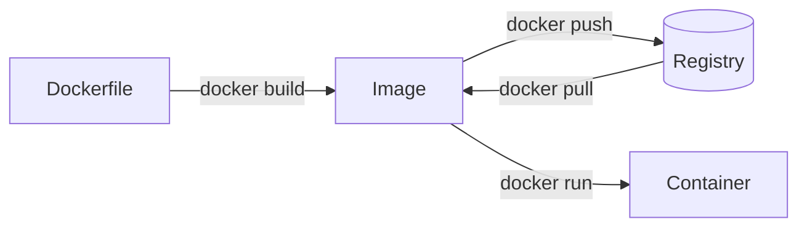

<!--
layout: title
eyebrow: Developer Platform · Tech Talk
byline: Docker Engineering
logo: assets/docker-logo-white.svg
-->

# Build. Ship. Run.

A developer's guide to the Docker platform — from your inner loop to production
CI/CD.

Note: Welcome people in. Ask how many have used Docker before: it changes how
long you spend on the next slide. Mention the lab is the second card on the
landing page and they'll get there in ~10 minutes.

---

<!-- layout: stats -->

# The numbers that define the modern dev workflow

:::stat{value="20B+"}
Docker Hub pulls per month across every language and stack
:::

:::stat{value="84%"}
of developers now use AI coding tools at least weekly
:::

:::stat{value="10×"}
faster build-test cycles with Docker Build Cloud vs local builders
:::

Note: These are the numbers people write down. Give them a beat each. If the room
is senior, skip straight to the third — the build-time one is the only one they
haven't already internalised.

---

<!--
layout: split
eyebrow: The inner loop problem
-->

# Where developer time actually goes

<!-- region -->

:::card{label="The problem" accent=red}

### Slow feedback loops kill momentum

- Waiting minutes per build cycle compounds into hours lost daily
- Environment drift between local and CI surfaces bugs late
- Unoptimized Dockerfiles rebuild every layer from scratch

:::

<!-- region -->

:::card{label="The fix" accent=green}

### Docker shortens the loop at every step

- Cache mounts and bind mounts eliminate redundant work
- Compose Watch syncs file changes without a rebuild
- Multi-stage builds separate dev toolchain from runtime image

:::

Note: This is the argument the whole talk hangs on. Don't read the bullets —
name the problem, then let them read the right-hand column while you talk.

---

<!--
layout: section
eyebrow: ""
-->

# Containerize Everything

Optimized Dockerfiles · Multi-stage builds · Compose Watch

Note: Chapter break. Good moment to check the clock — you should be about three
minutes in.

---

<!--
layout: split
theme: dark
eyebrow: Multi-stage builds
logo: assets/docker-logo-white.svg
-->

# Every layer you skip is time you get back

<!-- region -->

:tag[Before]{accent=red}

```dockerfile filename="Dockerfile · naive" no-run-button
FROM golang:1.22
WORKDIR /app
COPY . .
RUN go mod download
RUN go build -o server .
CMD ["./server"]
```

:::card{accent=red}

- Ships the full Go toolchain (~800 MB)
- Rebuilds deps on every source change
- No cache — slow in CI

:::

<!-- region -->

:tag[After]{accent=green}

```dockerfile filename="Dockerfile · optimized" highlight=4-5 no-run-button
FROM golang:1.22-alpine AS build
WORKDIR /src
RUN --mount=type=cache,target=/go/pkg/mod go mod download
RUN --mount=type=bind,target=. \
    go build -o /bin/server ./cmd/server

FROM scratch
COPY --from=build /bin/server /
ENTRYPOINT ["/server"]
```

:::card{accent=green}

- Runtime image is ~8 MB (scratch)
- Deps layer cached across builds
- Zero toolchain in the production image

:::

Note: The highlighted lines are the whole point — cache mount plus bind mount.
If you only have time for one code slide in this talk, it's this one.

---

<!-- layout: default -->

# The shape of the workflow



Note: Trace the arrows as you talk. Highlight that the registry is what makes the
artifact shareable — that's the bit newcomers skip.
