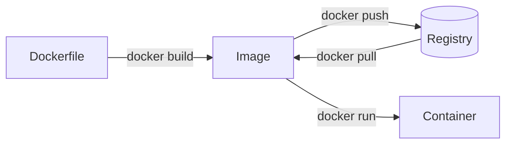

# A Tour of Docker

Containers, images, and the workflow around them — in about ten minutes.

Note: Welcome people in. Ask how many have used Docker before: it changes how
long you spend on the next slide. Mention the lab is the second card on the
landing page and they'll get there in ~10 minutes.

---

## Why containers?

Ship the environment, not just the code.

:::fragment
The same image runs on a laptop, in CI, and in production — because it carries
its own dependencies.
:::

:::fragment
"Works on my machine" stops being a sentence anybody says.
:::

Note: The two fragments are the payoff — pause after the first. If the room is
experienced, press through both quickly and move on; don't labour this.

---

## Three things to keep straight

| Thing         | What it is                            |
| ------------- | ------------------------------------- |
| **Image**     | The build artifact. Immutable.        |
| **Container** | A running instance of an image.       |
| **Registry**  | Where images live so others get them. |

Note: This is the slide people photograph. Leave it up while you explain, and
resist adding more rows — three is the point.

---

## The shape of the workflow

Note: Trace the arrows with the cursor as you talk. Highlight that the registry
is what makes the artifact shareable — that's the bit newcomers skip.
